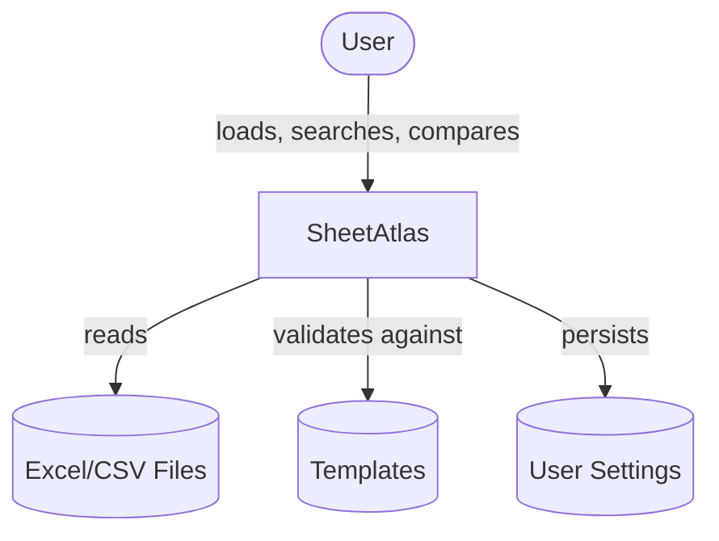
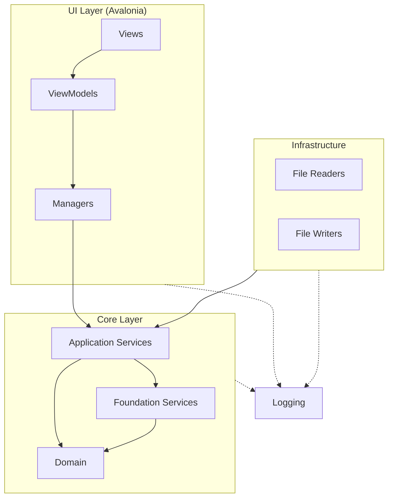
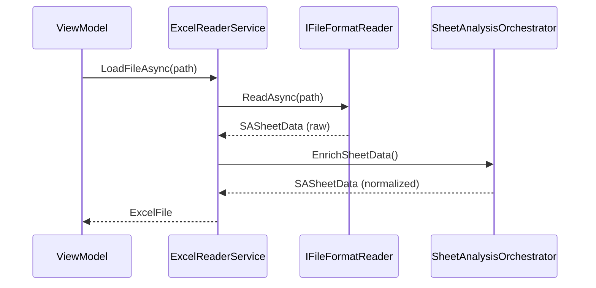
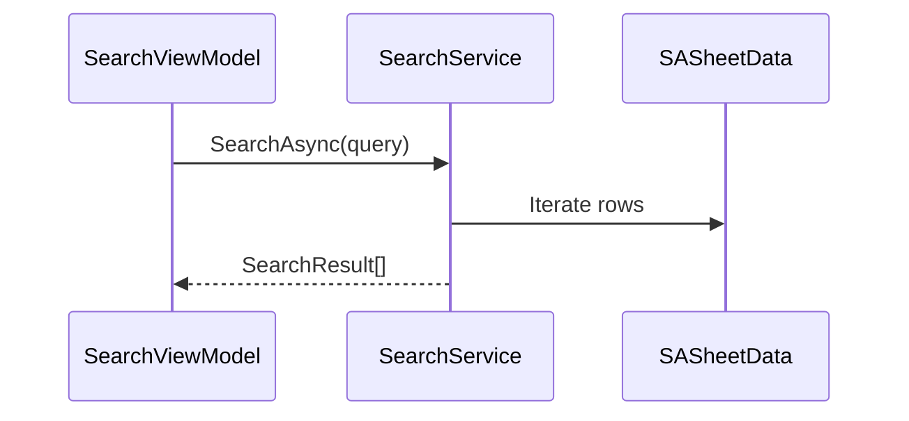

# Architecture

SheetAtlas follows Clean Architecture with four layers: UI, Core, Infrastructure, and Logging.

## System Context



## Layer Architecture



**Dependency Rule**: All dependencies flow downward. Core has no knowledge of UI or Infrastructure.

## Layers

### UI (SheetAtlas.UI.Avalonia)

| Component | Purpose |
|-----------|---------|
| **Views** | XAML, no code-behind logic |
| **ViewModels** | MVVM state and commands |
| **Managers** | UI coordination (Files, Search, Theme, Navigation) |
| **Services** | UI-specific (dialogs, file picker) |

### Core (SheetAtlas.Core)

**Application Services**:
- `SearchService` — full-text search across sheets
- `RowComparisonService` — row-by-row diff
- `SheetAnalysisOrchestrator` — analysis pipeline
- `ColumnLinkingService` — cross-file column linking
- `SettingsService` — user preferences

**Foundation Services**:
- `ColumnAnalysisService` — data type detection
- `DataNormalizationService` — value normalization
- `CurrencyDetector` — currency parsing
- `MergedCellResolver` — merged cell strategies
- `TemplateValidationService` — column validation

**Domain**:
- `ExcelFile`, `SASheetData` — file/sheet representation
- `SACellData`, `SACellValue` — cell data
- `SearchResult`, `RowComparison` — operation results

### Infrastructure (SheetAtlas.Infrastructure)

| Reader | Format | Library |
|--------|--------|---------|
| `OpenXmlFileReader` | .xlsx | DocumentFormat.OpenXml |
| `XlsFileReader` | .xls | ExcelDataReader |
| `CsvFileReader` | .csv | CsvHelper |

`FileReaderContext` facade groups common reader dependencies (see ADR-008).

Writers: `ExcelWriterService`, `ComparisonExportService`

### Logging (SheetAtlas.Logging)

Cross-cutting concern. `ILogService` abstraction injected into all layers.

## Key Patterns

| Pattern | Usage |
|---------|-------|
| **Strategy** | `IFileFormatReader` — pluggable file readers |
| **Facade** | `FileReaderContext` — groups reader dependencies |
| **MVVM** | ViewModels + Managers for UI |
| **Result Object** | Business errors returned, not thrown |

## Data Flow

### File Loading



### Search



## Dependencies

| Package | Version | Purpose |
|---------|---------|---------|
| DocumentFormat.OpenXml | 3.2.0 | XLSX read/write |
| ExcelDataReader | 3.7.0 | XLS support |
| CsvHelper | 33.0.1 | CSV parsing |
| Avalonia | 11.0.10 | Cross-platform UI |
| CommunityToolkit.Mvvm | 8.4.0 | MVVM utilities |
| Microsoft.Extensions.DI | 9.0.2 | Dependency injection |

## Project Structure

```
src/
├── SheetAtlas.Core/
│   ├── Application/
│   │   ├── Interfaces/      # Service contracts
│   │   ├── Services/        # Application services
│   │   │   └── Foundation/  # Foundation services
│   │   └── DTOs/
│   └── Domain/
│       ├── Entities/
│       └── ValueObjects/
├── SheetAtlas.Infrastructure/
│   └── External/
│       ├── Readers/         # File format readers
│       └── Writers/         # Export writers
├── SheetAtlas.Logging/
└── SheetAtlas.UI.Avalonia/
    ├── Views/
    ├── ViewModels/
    └── Managers/
```

## Related

- [ADR-007: Unified Data Flow](../../.personal/reference/decisions/007-unified-data-flow-for-export.md)
- [ADR-008: Facade Pattern](../../.personal/reference/decisions/008-facade-pattern-for-dependency-injection.md)
- [Technical Specs](technical-specs.md) — performance, security, config details

---

*Last updated: January 2026*
